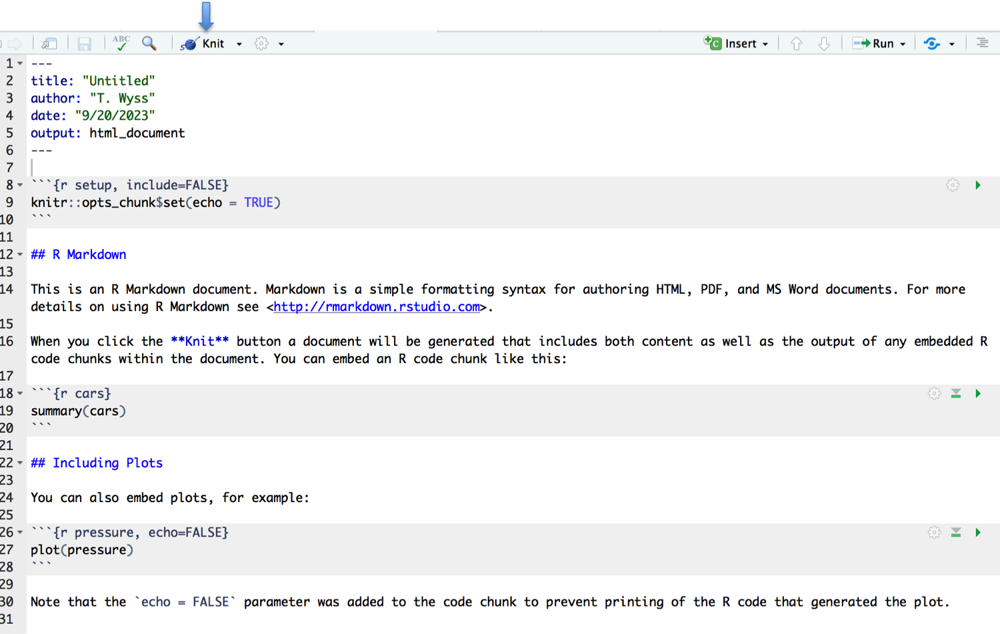

The following code shows more details about additional features of R, such as generating reports or running statistics. They might be useful for you.

## R markdown

If a data analysis project involves many steps and generation of various plots, one of the easy and very practical ways to bundle and organize all steps of analysis together is to use R markdown files to generate PDF or html reports. These reports both display the R code used as well as the output generated, such as graphics, tables, statistical test results, ...

The difference between an R script and an R markdown file, is that the code is organized within chunks in the R markdown file. In between the chunks, the user can write text that contains information about the analysis.

To create an R markdown file, go to File > New File > R markdown. Add a name.
This will create a new file that already has some example content. As you can see, the R code is organized in chunks highlighed in grey, with details written as free text in between the chunks. 
We can see that the pound sign (#) is used outside of the R code chunks. In this case, the # symbol does not correspond to a comment, but will indicate header levels for the titles and subtitles within your final document obtained after report generation.

Once the Rmd is ready, the report can be generated by hitting the "Knit" button at the top of the window. 
<figure>
  
</figure>


The example Rmd generates the following html report (saved in the same folder as the Rmd file by default), that shows both the code and the resulting output:
<figure>
  
</figure>


You can find a short video that introduces some of the principles of R markdown on [Youtube](https://www.youtube.com/watch?v=2YZSDGGoQzQ), from the beginning up to minute 23:30. Starting at minute 23:30, this video also introduces ggplot2.


If you would like to practice creating your own R markdown, modify the one that is generated with the example content when you select File > New File > R Markdown.

1) Create a new Rmd file with the following options at the top (in the top YAML instructions within the 2 dash sequences "- - -")

* Title: «Let’s practice»
* Author: your name
* Select the «use current date when rendering object» option
* Default output format: HTML

2) We can repeat the exercises of this course, but this time by creating a report:
Within an R code chunk, insert the R code that you would like to execute. You can include code to create plots for example.
If you have more than 1 plot to include, create a new R code chunk for each, and add a header (preceded by the # symbols **outside of the code chunks**) before each plot with some suggestive plot title.

3) Save the Rmd file and produce the html document by «knitting» it.

<!--[Download solution Rmd file](../assets/pdf/R_practice_Rmd_solution.Rmd){: .md-button }-->

For tweaking your reports, such as chosing different output formats, or hiding or showing the code within the report, we recommend that you consult the R markdown documentation provided in this [Definite guide eBook](https://bookdown.org/yihui/rmarkdown/).

Another useful resource is [RStudio's R Markdown tutorial](https://rmarkdown.rstudio.com/lesson-1.html). 

## Introduction to Statistics with R

The SIB course "First Steps with R in life sciences" provides additional material to perform statistics with R.

The slides introducing statistics with R can be found [here](https://github.com/sib-swiss/first-steps-with-R-training/blob/master/slides/First-steps-with-R_day2_afternoon.pdf) on the [course material github page](https://github.com/sib-swiss/first-steps-with-R-training). 

The R code to run Wilcoxon or T tests can be found [here (ex.9)](https://github.com/sib-swiss/first-steps-with-R-training/blob/master/solutions/R_practice9_solution.R) using source data that can be found [here](https://github.com/sib-swiss/first-steps-with-R-training/tree/master/course_datasets). The R code to run a linear model can be found [here (ex.10)](https://github.com/sib-swiss/first-steps-with-R-training/blob/master/solutions/R_practice10_solution.R). Feel free to try it out!

## RNA sequencing - example code

### Small information on a typical RNAseq workflow

[Download pdf](assets/pdf/brief_RNAseq_workflow.pdf){: .md-button }

### Example for differential expression analysis with DESeq2

Once sequencing reads have been aligned to the reference genome, and number of reads have been summarized per gene per sample, we can use R for downstream differential gene expression analysis. Several R packages exist for DE analysis, such as [DESeq2](https://bioconductor.org/packages/release/bioc/html/DESeq2.html), [limma](https://bioconductor.org/packages/release/bioc/html/limma.html) or [edgeR](https://bioconductor.org/packages/release/bioc/html/edgeR.html). The short code below shows the initial steps of DE analysis with DESeq2, starting from a text file that contains numbers of sequencing reads per gene per sample, _i.e._ a matrix of raw counts. The samples included in the example matrix come from natural killer and T helper cells sorted from the peripheral blood of healthy donors.

[Download data](assets/data/htseq_counts_NK_Th.csv){: .md-button }
[Download script](assets/data/DGE_DESeq2_example.R){: .md-button }

```r
# DGE example with DESeq2:
# R version 4.1.2 (2021-11-01)


BiocManager::install("DESeq2")
library(DESeq2) # v 1.34.0

# setwd("path/to/downloadedData")

counts_NK_Th<-read.csv("htseq_counts_NK_Th.csv", row.names = 1, header = T)

counts_NK_Th<-counts_NK_Th[-c(which(rowSums(counts_NK_Th)==0)),]
dim(counts_NK_Th)
# [1] 38573    15

# build a sample metadata table:
coldata<-as.data.frame(cbind(cell_type=c(rep("NK", 6),
                           rep("Th", 9)),
               donor=sapply(strsplit(colnames(counts_NK_Th), "_"), '[',1),
               sample_id=colnames(counts_NK_Th)))
coldata$cell_type<-as.factor(coldata$cell_type)
coldata$cell_type<-factor(coldata$cell_type,
                          levels=levels(coldata$cell_type)[c(2,1)])

head(coldata)
#   cell_type donor         sample_id
# 1        NK   S15    S15_NK_CD56dim
# 2        NK   S15 S15_NK_CD56bright
# 3        NK   S16    S16_NK_CD56dim
# 4        NK   S16 S16_NK_CD56bright
# 5        NK   S17    S17_NK_CD56dim
# 6        NK   S17 S17_NK_CD56bright

# Create DESeq object:
dds <- DESeqDataSetFromMatrix(countData = counts_NK_Th,
                              colData = coldata,
                              design= ~ donor + cell_type) # Difference between cell types, accounting for the sample pairing
dds <- DESeq(dds)
resultsNames(dds) # lists the coefficients
# [1] "Intercept"          "donor_S16_vs_S15"   "donor_S17_vs_S15"   "cell_type_NK_vs_Th"

deseq2_NK_vs_Th <- as.data.frame(results(dds,  
                                         alpha=0.05, 
                                         contrast=c("cell_type","NK","Th"),
                                 cooksCutoff=F)) # use cooksCutoff=F only if some genes of interest do not have a calculated p-value
                                                # author recomendation is to use default cooksCutoff=T    

head(deseq2_NK_vs_Th)
#            baseMean log2FoldChange     lfcSE        stat       pvalue         padj
# TSPAN6     40.851111     -6.9583034 1.1044621 -6.30017417 2.973114e-10 8.742152e-09
# TNMD        0.104281     -0.1228379 3.1336380 -0.03919977 9.687311e-01           NA
# DPM1     2566.964652     -0.1466129 0.2211112 -0.66307338 5.072836e-01 7.133950e-01
# SCYL3     571.791633      0.5728065 0.4039864  1.41788547 1.562242e-01 3.515869e-01
# C1orf112  201.504414      0.8758449 0.5938469  1.47486651 1.402484e-01 3.263445e-01
# FGR      8793.900467      8.5188295 1.2025099  7.08420757 1.398422e-12 5.868549e-11

deseq2_NK_vs_Th[grep("CPS1", rownames(deseq2_NK_vs_Th)),]
#            baseMean log2FoldChange    lfcSE        stat     pvalue      padj
# CPS1     2.34916186    -3.56324252 1.855768 -1.92009033 0.05484649 0.1702518
# CPS1.IT1 0.09375824    -0.08381473 3.134376 -0.02674048 0.97866673        NA
deseq2_NK_vs_Th[grep("GZMB", rownames(deseq2_NK_vs_Th)),]
#      baseMean log2FoldChange     lfcSE     stat       pvalue        padj
# GZMB 27758.47       9.075387 0.8897603 10.19981 1.986563e-24 2.65665e-22

```


