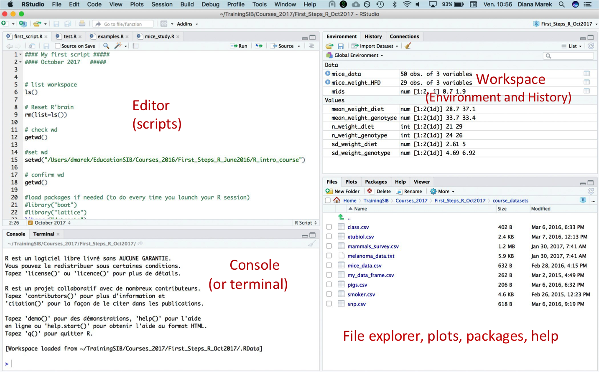

In this section, you will find the R code that we will use during the course. We will explain the code and output during correction of the exercises.

<!-- This is commented text -->

<!-- ## Source of data -->


## First exploration of R using RStudio

Four windows are displayed by default within RStudio. One of the windows corresponds to the R console.

<figure>
  
</figure>


Type the following commands within the console (bottom left window in RStudio) at the prompt (">"), followed by the "Enter" key after each one to view the output printed on the console.

```r
1 + 1
```
The first command (1 + 1) prints "2" in the console. There you can see that R can also simply be used as a calculator. 
```r
x	<- 128.5
```
The second command does not print anything in the console, but a new variable called "x" and that contains the value 128.5 is created and listed in the Workspace (top right window in RStudio).

The assignment operator `<-` : The nice part of R is that one can keep values in the memory, by using the _assignment operator_ `<-` which is used to assign a value (here 128.5) and a name to a variable (here x) and store it in the session's memory. We can use either `<-` or `=` to assign values to an object. Stick to one for consistency.
```r
x
```
The third command prints the value stored within the "x" variable in the console.
```r
abs(-11)
```
The fourth command, with the use of the abs() function, prints the absolute value of -11 in the console.
```r
?p.adjust
```
Finally, the fifth command opens the help page for the p.adjust function (bottom right "Help" window in RStudio). What does this function do?


## Working directory

To manipulate data within R, we first need to import it. R needs a way to locate the files within the hard drive or system. Therefore, we can specify the working directory, i.e. the location where R will look for files.

!!! warning
    To run the code below with setwd() make sure you put within the quotes a path that exists within your system.

```r

# To see what is the current working directory, use the function:
getwd()
# [1] "C:/Users/twyss/Documents/Rcourse"

# To change the working directory to any existing folder on your hard drive or system, use setwd() and the file path within quotes, e.g.
setwd("D:/R_exercises/")

``` 

## Workspace - Environment and history

Once a value has been assigned to a named variable, as we did assigning 128.5 to x above, the variable is saved and listed within the Workspace, which is displayed in one of the RStudio windows. 

Explore your workspace using the command line:

```r
# To list the objects or variables that are in your workspace, type
ls()
# To remove (delete) an object from the workspace, use function rm():
rm(x)
# To remove (delete) all objects from the workspace, type
rm(list=ls())

```

## Let's practice - Create a script

R scripts allow you to save all code for further use or reference. For big projects, it is essential to create an R script.
To create a script, go to **File > New File > R Script**. Save it with file name "ex1.R" or any other that is suitable for you.
Add a comment symbol (`#`, the pound or hash sign) at the beginning of the first line.

Type or paste the following code. Look at the script (before running it).

Can you understand each line? What do you expect it to print to the console? Next, run the script and explore RStudio features such as the Workspace (Environment). Run the script line by line. Try both the "Run" button and the keyboard shortcut.  Watch variables appear in the Environment window (top right).
Watch what is printed to the console (bottom left window). Does it match your expectation?

```r

# First Steps and commands, ex. 1  
w <- 3
h <- 0.5
area <- w * h 
area
```

To run a line in the script within RStudio, place your cursor anywhere in a line, and hit: 

* Ctrl + Enter (Windows).  
* Cmd + Enter (Mac).  
* or click the "Run" button located above the script file.   

Tips: 

* Run part of a line or multiple lines: Highlight the code, then proceed as  above.   
* Most of your code should be developed and saved in  scripts.   
* You can execute individual lines of code interactively while you are writing it.   
* You can run the entire script once it is ready and debugged.   

Don't forget  to save your script often and to have a back-up!
Also, notice the syntax highlighting within the script: Comments are in <span style="color:green">green</span>, functions and variables are in **black**, numbers are in <span style="color:blue">blue</span>.

## Packages

When R is installed for the first time, a set of "base" packages is installed along the R software. The list of available packages can be viewed in the package Explorer window within RStudio (bottom right "Packages" window). Each package is a bundle of functions designed and created by an author to perform specific, usually related tasks. When working with "non-standard" data types, eg in bioinformatics or flow cytometry analysis, packages with bioinformatics-related functions need to be installed by the user. 

Common repositories for packages are CRAN and Bioconductor (also github, but it is not restricted to hosting R packages)

Install packages from [CRAN](https://cran.r-project.org/web/packages/available_packages_by_name.html) with the install.packages() function.

To install packages hosted on [Bioconductor](https://bioconductor.org/), we need 2 steps. First, we install a package called `BiocManager`, that will allow us to have access to the `install()` function to download Bioconductor packages.

```r
# Install packages hosted on CRAN: use a function from the utils package:
install.packages("stringi") # stringi is a package for character string manipulations

# Install packages hosted on bioconductor: first install the BiocManager package that is available on CRAN:
install.packages("BiocManager")

# Then use the install() function from the BiocManager package
# !! This takes time to complete, run it during coffee or lunch break!
# Install limma:
BiocManager::install("limma")

```

Once a package is installed, its content and functions need to be made accessible to R. `library()` loads the package for the current session.
It is good practice to load all needed packages at the top of a script.

```r
# My Script

library(stringi)
library(DESeq2) 
library(MASS)  
library(ggplot2)

```

If you run the above code, what is the output on the Console? What does it mean?

??? done "Answer"
  	Packages such as DESeq2 are not installed as base packages. They are hosted on Bioconductor and provide functions for RNAseq or microarray data analysis. The error message indicates that these packages were not installed and need to be installed before being able to load them.


## R version and session information

R is constantly upgraded by developers, who release a new version of R about every 6 months. Along with R upgrades, packages also get upgrades. From one version to the other of a package, it may happen that the default parameters of functions change. Therefore, it is important to always have in mind which current version of R and packages have been used for any analysis. Print the current R version and versions of attached or loaded packages using:

```r
# Prints the currently used R version
R.version.string	

# Print version information about R and all attached or loaded packages
sessionInfo() 

# Print the version of a specific package:
packageVersion("stringi")
```

## Let's practice - Follow our script !

Download and open the provided commented script within R, run the commands and view the the output!

In our script, we included some sections with "fill in the blanks" exercises. You can either download the script without the solutions (first button), or the script with the solutions. 

[Download script without solutions](assets/scripts/intro-to_R_scripts_woSolutions.R){: .md-button }

[Download script with solutions](assets/scripts/intro-to_R_scripts.R){: .md-button }

!!! warning
    Make sure you have downloaded the csv files we import in the scripts from the [Materials](materials.md) section.


 


**End of your first day  with R, good job!**

<!--
## Feedback
-->


